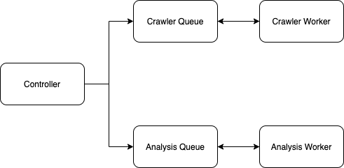

## Description

The KGB has noticed a resurgence of overly excited reviews for a McKaig Chevrolet Buick,
a dealership they have planted in the United States. In order to avoid attracting unwanted
attention, this service should scrape reviews for this dealership from DealerRater.com
and uncover the top three worst offenders of these overly positive endorsements.

## Requirements

Functional Requirements:

1. Scrapes the first five pages of reviews.
2. Identifies the top three most “overly positive” endorsements.
3. Outputs these three reviews to the console, in order of severity.

## System Overview



#### Highlights

* Automatic crawling retries.
* Automatic recovery from process crashes.
* Robust design based on Redis that can handle distributed job processing.
* Failed jobs are retained for reprocessing.

#### Controller Service

The controller service orchestrates the flow of processing beginning with the original input
and ends by printing the top three worst offenders. Controller service should be provided an input
URL for the first page of reviews. The controller will queue the URL for crawling and then queue
the extracted reviews for processing. Finally when both the crawler and analysis queues are empty
the controller service will calculate and print the top three worst offenders of overly positive
endorsements.

#### Queue Service

A queue service is used to provide fault tolerance for both crawling and analysis processes.

#### Crawler Service

Input example:

```json
{
  "url": "https://www.dealerrater.com/dealer/McKaig-Chevrolet-Buick-A-Dealer-For-The-People-dealer-reviews-23685/page1",
  "page": 1,
  "maxPages": 5
}
```

Output example:

```json
{
  "reviews": [
    {
      "title": "The perfect car!",
      "body": "I had a wonderful experience buying my super duper awesome car!",
      "date": "2020-11-10T07:00:00.000Z",
      "user": "kary3092"
    }
  ]
}
```

#### Analysis Service

Input example:

```json
{
  "review": {
    "title": "The perfect car!",
    "body": "I had a wonderful experience buying my super duper awesome car!",
    "date": "2020-11-10T07:00:00.000Z",
    "user": "kary3092"
  }
}
```

Output example:

```json
{
  "review": {
    "title": "The perfect car!",
    "body": "I had a wonderful experience buying my super duper awesome car!",
    "date": "2020-11-10T07:00:00.000Z",
    "user": "kary3092"
  },
  "analysis": {
    "score": 0.2
  }
}
```

#### Determining Fake Reviews

The analysis service uses a library named "Sentiment" which is a Node.js module that uses the AFINN-165 wordlist and Emoji Sentiment Ranking to perform sentiment analysis on arbitrary blocks of input text. AFINN is a list of words rated for valence with an integer between minus five (negative) and plus five (positive). Sentiment analysis is performed by cross-checking the string tokens (words, emojis) with the AFINN list and getting their respective scores. The comparative score is simply: sum of each token / number of tokens.

## Technologies Used

- Docker
- Node.js
- Redis (queue)
- Osmosis (web scraper)
- Jest (testing)
